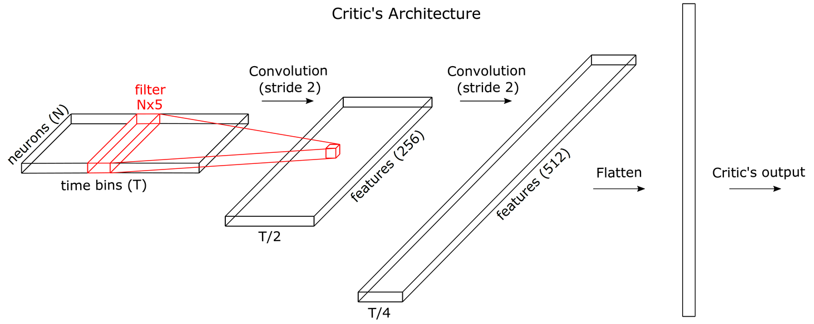

# Spike-GAN

Tensorflow implementation of Spike-GAN, which allows generating realistic patterns of neural activity whose statistics approximate a given traing dataset ([Molano-Mazon et al. 2018 ICRL2018](https://openreview.net/forum?id=r1VVsebAZ)). 



### Prerequisites

* Python 3.5+
* Tensorflow 0.12.1.
* Numpy.
* SciPy.
* Matplotlib.

All necessary modules can be installed via [Anaconda](https://anaconda.org/). 

### Installing

Just download the repository to your computer and add the Spike-GAN folder to your path.


### Data
The folder named data contains the retinal data used for Fig. 3 in the ICLR paper. The whole data set can be found in [Marre et al. 2014](https://datarep.app.ist.ac.at/61/). The folder also contains the data generated by the [k-pairwise](http://journals.plos.org/ploscompbiol/article?id=10.1371/journal.pcbi.1003408) and the [Dichotomized-Gaussian](https://www.frontiersin.org/articles/10.3389/fncom.2010.00144/full) models for that same figure and for Fig. S6. Spike-GAN can be run using this data with the command:

```
python3.5 main_conv.py --architecture='conv' --dataset='retina' --num_bins=32 --iteration='test' --num_neurons=50 --is_train --num_layers=2 --num_features=128 --kernel_width=5 --data_instance='1'
```

### Example

The example below will train Spike-GAN with the semi-convolutional architecture on a simulated dataset containing the activity of two correlated neurons whose firing rate follows a uniform distribution across 12 ms. See main_conv.py for more options on the type of simulated activity (refractory period, firing rate...).

```
python3.5 main_conv.py --is_train --architecture='conv' --dataset='uniform' --num_bins=12 --num_neurons=2 
```


### Authors
* [Manuel Molano](https://github.com/manuelmolano).
* [Arno Onken](https://github.com/asnelt).
* [Eugenio Piasini](https://github.com/epiasini).
